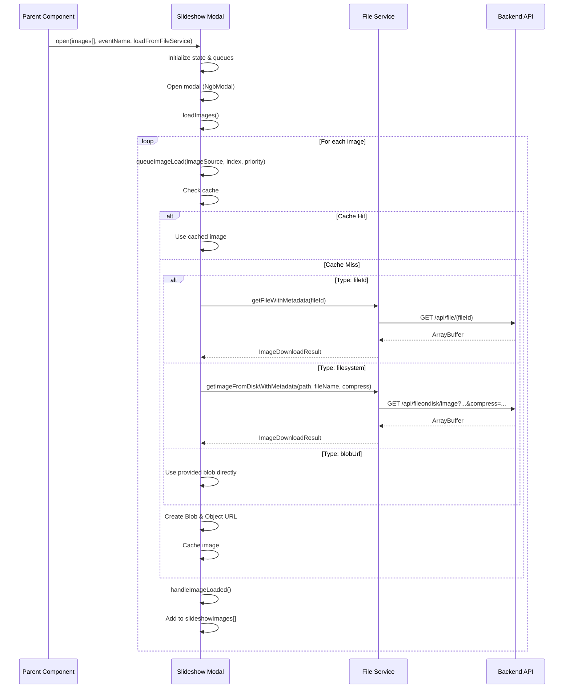

# Slideshow Image Loading - Complete Technical Report

## Executive Summary

This document provides a comprehensive explanation of how the slideshow modal component receives and loads images from the frontend. The slideshow supports multiple image source types and uses sophisticated caching and parallel loading mechanisms for optimal performance.

---

## Slideshow Documentation (HTML)

For a beautiful, professional HTML presentation of this documentation with enhanced formatting, visual diagrams, and interactive navigation, please refer to:

**[📸 Slideshow Documentation (HTML)](./SLIDESHOW_DOCUMENTATION.html)**

The HTML documentation provides:
- ✨ Professional, modern design with responsive layout
- 🎨 Color-coded sections and visual hierarchy
- 📊 Interactive flow diagrams and code examples
- 🔍 Smooth scrolling navigation with section highlighting
- 📱 Mobile-responsive design for all devices
- 🖨️ Print-friendly styles for documentation printing
- ⚡ Interactive elements and smooth animations

The HTML version contains the same comprehensive information as this markdown report, presented in an enhanced, visually appealing format ideal for viewing in a web browser.

---

## 1. Architecture Overview

### 1.1 Component Structure

The slideshow is implemented as an Angular component (`SlideshowModalComponent`) with the following key characteristics:

- **Selector**: `app-slideshow-modal`
- **Input Properties**: 
  - `images: SlideshowImageSource[]` - Array of image sources
  - `eventName: string` - Name of the event for display
  - `loadFromFileService: boolean` - Flag to use FileService for MongoDB images

### 1.2 Image Source Interface

```typescript
export interface SlideshowImageSource {
  fileId?: string;              // MongoDB file ID (for database-stored images)
  blobUrl?: string;             // Direct blob URL (for pre-loaded images)
  blob?: Blob;                  // Blob object (for CSP-safe image handling)
  fileName?: string;            // Display name for EXIF modal
  relativePath?: string;        // Filesystem relative path
  compressFs?: boolean;         // Compression flag for filesystem images
  patMetadata?: PatMetadata;    // Image metadata (size, EXIF info)
}
```

---

## 2. Image Source Types

The slideshow supports **three distinct image source types**, each with its own loading mechanism:

### 2.1 Type 1: MongoDB File Service Images (`fileId`)

**When Used:**
- Images stored in MongoDB GridFS
- Accessed via the FileService REST API
- Most common for uploaded event photos

**Loading Flow:**
```
Parent Component → SlideshowImageSource with fileId → 
FileService.getFileWithMetadata(fileId) → 
HTTP GET /api/file/{fileId} → 
Backend GridFS → 
ArrayBuffer Response → 
Blob Creation → 
Object URL → 
Slideshow Display
```

**Example from Parent Component:**
```typescript
// element-evenement.component.ts
const imageSources: SlideshowImageSource[] = imageFiles.map(file => ({
  fileId: file.fieldId,      // MongoDB file ID
  blobUrl: undefined,
  fileName: file.fileName
}));

slideshowModalComponent.open(imageSources, eventName, true); // loadFromFileService = true
```

### 2.2 Type 2: Filesystem Images (`relativePath` + `fileName`)

**When Used:**
- Images stored on the server's filesystem
- Accessed via disk file system endpoints
- Supports compressed and original variants

**Loading Flow:**
```
Parent Component → SlideshowImageSource with relativePath/fileName → 
FileService.getImageFromDiskWithMetadata(path, fileName, compress) → 
HTTP GET /api/fileondisk/image?relativePath=...&fileName=...&compress=... → 
Backend Filesystem → 
ArrayBuffer Response → 
Blob Creation → 
Object URL → 
Slideshow Display
```

**Example from Parent Component:**
```typescript
// update-evenement.component.ts
const imageSource: SlideshowImageSource = {
  blobUrl: url,
  fileId: undefined,
  blob: blob,
  fileName: fileName,
  relativePath: relativePath,
  compressFs: compress,        // true = compressed, false = original
  patMetadata: patMetadata
};
```

**Special Features:**
- **Compression Support**: Can load compressed or original versions
- **O Button Toggle**: Users can switch between compressed/original via O button
- **Separate Caching**: Compressed and original versions are cached separately

### 2.3 Type 3: Pre-loaded Blob Images (`blobUrl` + `blob`)

**When Used:**
- Images already loaded in memory as Blobs
- Direct blob URLs provided by parent component
- Fastest loading (no network request)

**Loading Flow:**
```
Parent Component → SlideshowImageSource with blobUrl + blob → 
Direct Object URL → 
Slideshow Display (instant)
```

**Example from Parent Component:**
```typescript
// Any component with pre-loaded blob
const imageSource: SlideshowImageSource = {
  blobUrl: objectUrl,          // Already created blob URL
  blob: blobObject,            // Blob object
  fileName: 'photo.jpg'
};
```

---

## 3. Complete Loading Pipeline

### 3.1 Initialization Flow



### 3.2 Detailed Loading Process

#### Step 1: Open Method (`open()`)

**Location**: `slideshow-modal.component.ts:407`

```typescript
public open(images: SlideshowImageSource[], eventName: string = '', 
           loadFromFileService: boolean = false): void {
  // 1. Store image sources
  this.images = images;
  this.eventName = eventName;
  this.loadFromFileService = loadFromFileService;
  
  // 2. Reset all state
  this.slideshowImages = [];
  this.imageCache.clear();
  this.filesystemImageVariants.clear();
  
  // 3. Open modal
  this.modalRef = this.modalService.open(this.slideshowModal, {...});
  
  // 4. Load images
  this.loadImages();
}
```

#### Step 2: Load Images (`loadImages()`)

**Location**: `slideshow-modal.component.ts:895`

```typescript
private loadImages(): void {
  // Queue all images with priority
  this.images.forEach((imageSource, imageIndex) => {
    const priority = imageIndex; // Lower = higher priority
    this.queueImageLoad(imageSource, imageIndex, priority);
  });
}
```

#### Step 3: Queue Image Load (`queueImageLoad()`)

**Location**: `slideshow-modal.component.ts:538`

```typescript
private queueImageLoad(imageSource: SlideshowImageSource, 
                      imageIndex: number, priority: number = 0): void {
  // Add to priority queue
  this.imageLoadQueue.push({ imageSource, imageIndex, priority });
  this.imageLoadQueue.sort((a, b) => a.priority - b.priority);
  
  // Process queue
  this.processImageLoadQueue();
}
```

#### Step 4: Process Queue (`processImageLoadQueue()`)

**Location**: `slideshow-modal.component.ts:573`

**Key Features:**
- **Parallel Loading**: Up to 48 concurrent image loads (`maxConcurrentImageLoads`)
- **Cache Checking**: Checks cache before network request
- **Loading State Tracking**: Prevents duplicate requests

```typescript
private processImageLoadQueue(): void {
  while (this.activeImageLoads < this.maxConcurrentImageLoads && 
         this.imageLoadQueue.length > 0) {
    const item = this.imageLoadQueue.shift();
    const { imageSource, imageIndex } = item;
    const cacheKey = this.getImageCacheKey(imageSource);
    
    // 1. Check cache
    if (cacheKey && this.imageCache.has(cacheKey)) {
      const cached = this.imageCache.get(cacheKey)!;
      this.handleImageLoaded(cached.objectUrl, cached.blob, imageIndex, cached.metadata);
      continue;
    }
    
    // 2. Check if already loading
    if (cacheKey && this.loadingImageKeys.has(cacheKey)) {
      // Add to pending list - will be handled when first load finishes
      this.pendingImageLoads.get(cacheKey)!.push(imageIndex);
      continue;
    }
    
    // 3. Load based on source type
    if (this.loadFromFileService && imageSource.fileId) {
      // Type 1: MongoDB via FileService
      this.fileService.getFileWithMetadata(imageSource.fileId).subscribe(...);
    } else if (imageSource.relativePath && imageSource.fileName) {
      // Type 2: Filesystem
      this.fileService.getImageFromDiskWithMetadata(
        imageSource.relativePath, 
        imageSource.fileName, 
        !!imageSource.compressFs
      ).subscribe(...);
    } else if (imageSource.blobUrl) {
      // Type 3: Pre-loaded blob
      this.handleImageLoaded(imageSource.blobUrl, imageSource.blob, imageIndex);
    }
  }
}
```

#### Step 5: Handle Loaded Image (`handleImageLoaded()`)

**Location**: `slideshow-modal.component.ts:757`

```typescript
private handleImageLoaded(objectUrl: string, blob: Blob | null, 
                         imageIndex: number, metadata?: PatMetadata): void {
  // 1. Add to slideshow images array
  const slideshowIndex = this.slideshowImages.length;
  this.slideshowImages.push(objectUrl);
  
  // 2. Track filesystem variants (compressed/original)
  if (imageSource.relativePath && imageSource.fileName) {
    // Store variant information
    const variantType = imageSource.compressFs === false ? 'original' : 'compressed';
    let variants = this.filesystemImageVariants.get(imageIndex);
    if (!variants) {
      variants = { currentVariant: variantType };
      this.filesystemImageVariants.set(imageIndex, variants);
    }
    // Store URL and metadata for variant
    if (variantType === 'original') {
      variants.originalUrl = objectUrl;
      variants.originalMetadata = metadata;
    } else {
      variants.compressedUrl = objectUrl;
      variants.compressedMetadata = metadata;
    }
  }
  
  // 3. Store blob for thumbnail generation
  if (blob) {
    this.thumbnailBlobStorage.set(imageIndex, blob);
  }
  
  // 4. Pre-load EXIF data
  if (blob) {
    this.preloadExifData(objectUrl, blob);
  }
  
  // 5. Trigger change detection
  this.cdr.detectChanges();
}
```

---

## 4. Caching Mechanism

### 4.1 Cache Structure

The slideshow uses a **multi-level caching system**:

```typescript
// Primary cache: Stores blob, URL, and metadata
private imageCache: Map<string, {
  objectUrl: string;
  blob: Blob;
  metadata?: PatMetadata;
}> = new Map();

// Filesystem variants cache: Tracks compressed/original separately
private filesystemImageVariants: Map<number, {
  compressedUrl?: string;
  originalUrl?: string;
  compressedMetadata?: PatMetadata;
  originalMetadata?: PatMetadata;
  currentVariant: 'compressed' | 'original';
}> = new Map();

// Blob storage: For thumbnail generation
private slideshowBlobs: Map<string, Blob> = new Map();
```

### 4.2 Cache Key Generation

**Location**: `slideshow-modal.component.ts:555`

```typescript
private getImageCacheKey(imageSource: SlideshowImageSource): string | null {
  if (imageSource.fileId) {
    return `fileId:${imageSource.fileId}`;
  } else if (imageSource.relativePath && imageSource.fileName) {
    const compressKey = imageSource.compressFs ? ':compressed' : '';
    return `disk:${imageSource.relativePath}/${imageSource.fileName}${compressKey}`;
  } else if (imageSource.blobUrl) {
    return `blob:${imageSource.blobUrl}`;
  }
  return null;
}
```

**Cache Key Examples:**
- MongoDB: `fileId:507f1f77bcf86cd799439011`
- Filesystem Compressed: `disk:2024/12_25_from_uploaded/photo.jpg:compressed`
- Filesystem Original: `disk:2024/12_25_from_uploaded/photo.jpg`
- Blob: `blob:blob:http://localhost:4200/abc123...`

### 4.3 Cache Benefits

1. **Avoids Redundant Requests**: Same image loaded once
2. **Separate Variants**: Compressed and original cached independently
3. **Fast Switching**: O button toggle uses cached variant
4. **Memory Efficient**: Blob URLs managed properly

---

## 5. Parent Component Integration

### 5.1 Component Declaration

Parent components declare the slideshow modal:

```html
<!-- element-evenement.component.html -->
<app-slideshow-modal 
  #slideshowModalComponent 
  (closed)="onSlideshowClosed()" 
  (openLocationInTrace)="onSlideshowLocationInTrace($event)">
</app-slideshow-modal>
```

### 5.2 Opening the Slideshow

#### Example 1: MongoDB Images (Most Common)

```typescript
// element-evenement.component.ts
public openSlideshow(): void {
  const imageFiles = this.evenement.fileUploadeds.filter(
    file => this.isImageFile(file.fileName)
  );
  
  const imageSources: SlideshowImageSource[] = imageFiles.map(file => ({
    fileId: file.fieldId,        // MongoDB ID
    blobUrl: undefined,
    fileName: file.fileName
  }));
  
  this.slideshowModalComponent.open(
    imageSources, 
    this.evenement.evenementName, 
    true  // loadFromFileService = true
  );
}
```

#### Example 2: Filesystem Images

```typescript
// home-evenements.component.ts
public openSlideshow(evenement: Evenement): void {
  // Get filesystem file names
  const fileNames = this.getFileSystemImageFiles(evenement);
  
  const imageSources: SlideshowImageSource[] = fileNames.map((fileName: string) => ({
    relativePath: '2024/12_25_from_uploaded',
    fileName: fileName,
    compressFs: true  // Start with compressed
  }));
  
  this.slideshowModalComponent.open(
    imageSources, 
    evenement.evenementName, 
    false  // loadFromFileService = false
  );
}
```

#### Example 3: Pre-loaded Blobs

```typescript
// update-evenement.component.ts
const blob = new Blob([imageData], { type: 'image/jpeg' });
const objectUrl = URL.createObjectURL(blob);

const imageSource: SlideshowImageSource = {
  blobUrl: objectUrl,
  blob: blob,
  fileName: 'photo.jpg',
  relativePath: relativePath,
  compressFs: compress,
  patMetadata: metadata
};

this.slideshowModalComponent.open([imageSource], eventName, false);
```

---

## 6. File Service Methods

### 6.1 MongoDB Images

**Method**: `getFileWithMetadata(fileId: string)`

**Backend Endpoint**: `GET /api/file/{fileId}`

**Returns**: 
```typescript
{
  buffer: ArrayBuffer;
  headers: HttpHeaders;
  metadata?: PatMetadata;
}
```

### 6.2 Filesystem Images

**Method**: `getImageFromDiskWithMetadata(relativePath: string, fileName: string, compress: boolean)`

**Backend Endpoint**: `GET /api/fileondisk/image?relativePath=...&fileName=...&compress=...`

**Returns**: Same as MongoDB method

**Special Parameter**:
- `compress=true`: Returns compressed version
- `compress=false`: Returns original version

---

## 7. Parallel Loading & Performance

### 7.1 Concurrent Loading

- **Maximum Concurrent Loads**: 48 images simultaneously
- **Priority Queue**: Images loaded in order (first images first)
- **Pending Requests**: Multiple components can request same image

### 7.2 Loading States

```typescript
private activeImageLoads: number = 0;              // Currently loading
private loadingImageKeys: Set<string> = new Set(); // Keys being loaded
private pendingImageLoads: Map<string, number[]>;  // Waiting for same image
```

### 7.3 Thumbnail Generation

- **Decoupled**: Runs independently from main image loading
- **Queue System**: Processes thumbnails in background
- **Maximum Concurrent**: 8 thumbnails at once

---

## 8. Memory Management

### 8.1 Blob URL Management

All blob URLs are properly managed:

```typescript
// Create blob URL
const objectUrl = URL.createObjectURL(blob);
this.slideshowBlobs.set(objectUrl, blob);

// Cleanup on close
this.slideshowImages.forEach(url => {
  if (url.startsWith('blob:')) {
    URL.revokeObjectURL(url);  // Free memory
  }
});
```

### 8.2 Cache Cleanup

```typescript
private cleanupAllMemory(): void {
  this.imageCache.clear();
  this.filesystemImageVariants.clear();
  this.slideshowBlobs.clear();
  this.exifDataCache.clear();
  // ... revoke all blob URLs
}
```

---

## 9. Special Features

### 9.1 O Button - Compression Toggle

The O button allows users to switch between compressed and original versions:

**Location**: `slideshow-modal.component.ts:2746`

```typescript
public toggleFilesystemImageQuality(): void {
  // 1. Get current variant
  const currentVariant = variants.currentVariant;
  const targetVariant = currentVariant === 'original' ? 'compressed' : 'original';
  
  // 2. Check if variant is already loaded
  if (targetVariant === 'original' && variants.originalUrl) {
    // Use cached original
    this.applyFilesystemVariant(variants.originalUrl, ...);
    return;
  }
  
  // 3. Load variant if not cached
  const compressFlag = targetVariant === 'compressed';
  this.fileService.getImageFromDiskWithMetadata(
    imageSource.relativePath,
    imageSource.fileName,
    compressFlag
  ).subscribe(...);
}
```

### 9.2 EXIF Data Loading

- Pre-loaded in background for current image
- Cached per image URL
- Available instantly when user clicks info button

### 9.3 Thumbnail Generation

- Automatic generation from loaded images
- Independent queue system
- Displayed in thumbnail strip

---

## 10. Error Handling

### 10.1 Loading Failures

```typescript
.subscribe(
  (result) => {
    // Success: handle image
    this.handleImageLoaded(...);
  },
  (error) => {
    // Error: cleanup and continue
    this.loadingImageKeys.delete(cacheKey);
    this.activeImageLoads--;
    this.processImageLoadQueue();  // Continue with next image
  }
);
```

### 10.2 Modal Retry Logic

If modal fails to open:

```typescript
if (!this.slideshowModal) {
  setTimeout(() => {
    this.open(images, eventName, loadFromFileService, retryCount + 1);
  }, 100);
  return;
}
```

---

## 11. Data Flow Summary

```
┌─────────────────────────────────────────────────────────────┐
│                     PARENT COMPONENT                         │
│  (element-evenement, home-evenements, etc.)                  │
└────────────────────┬────────────────────────────────────────┘
                     │
                     │ Creates SlideshowImageSource[]
                     │ { fileId? | relativePath? | blobUrl? }
                     ▼
┌─────────────────────────────────────────────────────────────┐
│              SLIDESHOW MODAL COMPONENT                       │
│                                                              │
│  1. open() - Receives images array                           │
│  2. loadImages() - Queues all images                         │
│  3. processImageLoadQueue() - Parallel loading               │
│     ├─ Check cache (imageCache)                              │
│     ├─ Check loading state (loadingImageKeys)                │
│     └─ Load via FileService if needed                        │
│  4. handleImageLoaded() - Process result                     │
│     ├─ Create Object URL                                     │
│     ├─ Store in slideshowImages[]                            │
│     ├─ Cache in imageCache                                   │
│     └─ Track filesystem variants                             │
└────────────────────┬────────────────────────────────────────┘
                     │
                     │ HTTP Request (if needed)
                     ▼
┌─────────────────────────────────────────────────────────────┐
│                    FILE SERVICE                              │
│                                                              │
│  getFileWithMetadata()        → MongoDB API                  │
│  getImageFromDiskWithMetadata() → Filesystem API             │
└────────────────────┬────────────────────────────────────────┘
                     │
                     │ HTTP GET
                     ▼
┌─────────────────────────────────────────────────────────────┐
│                    BACKEND API                               │
│                                                              │
│  /api/file/{fileId}            → GridFS MongoDB              │
│  /api/fileondisk/image?...     → Filesystem                 │
└─────────────────────────────────────────────────────────────┘
```

---

## 12. Best Practices for Parent Components

### 12.1 Providing Images

1. **Always provide `fileName`** for EXIF display
2. **Set `loadFromFileService=true`** for MongoDB images
3. **Set `compressFs` appropriately** for filesystem images
4. **Include `patMetadata`** if available for better info display

### 12.2 Memory Management

1. **Cleanup blob URLs** if you create them
2. **Don't hold references** to slideshow images after close
3. **Use provided blob** when available (avoids duplication)

### 12.3 Performance

1. **Limit initial image count** (slideshow loads all)
2. **Use compressed versions** by default for filesystem images
3. **Pre-load images** as blobs when possible for instant display

---

## 13. Conclusion

The slideshow component provides a flexible, high-performance image loading system that:

- ✅ Supports multiple image source types
- ✅ Implements intelligent caching
- ✅ Loads images in parallel
- ✅ Handles compressed/original variants
- ✅ Manages memory efficiently
- ✅ Provides smooth user experience

The architecture allows parent components to easily integrate image viewing functionality with minimal code while benefiting from sophisticated optimization features.

---

## Appendix: Key Methods Reference

| Method | Location | Purpose |
|--------|----------|---------|
| `open()` | 407 | Opens slideshow with images |
| `loadImages()` | 895 | Initiates image loading |
| `queueImageLoad()` | 538 | Queues image for loading |
| `processImageLoadQueue()` | 573 | Processes loading queue |
| `handleImageLoaded()` | 757 | Processes loaded image |
| `getImageCacheKey()` | 555 | Generates cache key |
| `toggleFilesystemImageQuality()` | 2746 | Toggles compressed/original |
| `cleanupAllMemory()` | 259 | Cleans up resources |

---

*Document Version: 1.0*  
*Last Updated: 2024*

